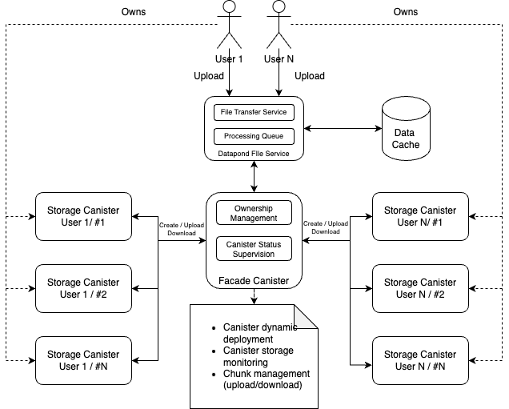

# icp-datapond-integration

## Overview

ReCheck has participated in the grant program of ICP with a project that aimed seamless integration of DataPond with ICP:

- identity integration
- mangement of tracing data on-chain
- management of web3 points on-chain
- on-chain storage of data

These objectives were achieved in the span of few months. This repository help find the relevant information and the delivered ICP integration code.

Insite this repository provides a sample code for II integration and ICP Canister integration with the Node.js API. The rest of the delivered code can be found respectively in the canister reposiories - [datapond-storage-canister](https://github.com/ReCheck-io/datapond-storage-canister), [datapond-tracing-canister](https://github.com/ReCheck-io/datapond-tracing-canister) and [datapond-points-canister](https://github.com/ReCheck-io/datapond-points-canister).

## Folders in this repository

- **`ii-integration-code`**: Contains sample codes for Internet Identity integration with React Context and hooks.
- **`canister-integration-code`**: Contains sample codes for the process of integration of Storage, Points and Tracing canisters.

## Canister repositories
- [datapond-storage-canister](https://github.com/ReCheck-io/datapond-storage-canister): Contains the source code of the solution that enabled Datapond.ai store content on-chain.
- [datapond-tracing-canister](https://github.com/ReCheck-io/datapond-tracing-canister): Contains the source code of the canister that Datapond.ai uses to store tracing information whenever a piece of data is processed or consumed.
- [datapond-points-canister](https://github.com/ReCheck-io/datapond-points-canister): Contains the source code of the canister that Datapond.ai uses to store and manage web3 points of users and transactions.

## Architecture Diagram

The architecture diagram provides an overview of the ICP integration with DataPond AI, showcasing the interaction between services and canisters.

## Other resources

- [Live environment of Datapond.ai](https://icp-prod.datapond.ai)
- [Awsome Internet Computer Register entry of Datapond](https://github.com/dfinity/awesome-internet-computer?tab=readme-ov-file#ai)

## License

This project is licensed under the [MIT License](LICENSE).
